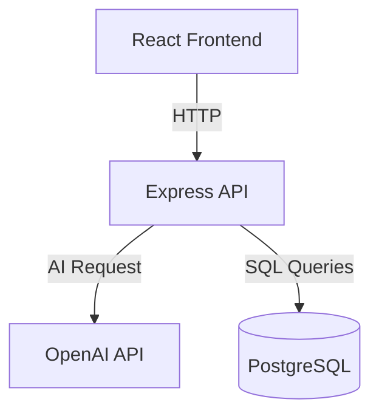

# Hi, I'm Elvis
Software Engineer | Backend & Interactive Systems Developer
Play my games: https://egaytan23.itch.io/
## About Me
Software engineer focused on backend development, REST APIs, cloud deployment, and scalable application architecture. I enjoy designing modular systems, integrating AI services, and building full-stack applications using modern development workflows including Docker, CI/CD, PostgreSQL, and React.

## ⭐ Featured Project:
- [AI-Assisted Job Application System](https://github.com/Egaytan23/ai-job-agent) — Full-stack AI-powered job analysis platform that evaluates job descriptions using OpenAI, stores analysis history in PostgreSQL, and provides an interactive React interface for reviewing results.
  - 🌐 Live Demo: https://ai-job-agent-1-pw5m.onrender.com/
  - ⚙️ Backend API: https://ai-job-agent-lbgs.onrender.com
  - Built a React frontend that communicates with a deployed Express REST API
  - Integrated OpenAI API to analyze job descriptions and generate structured hiring recommendations
  - Designed PostgreSQL persistence for storing and retrieving analysis history
  - Implemented full CRUD operations for job analyses
  - Containerized the backend using Docker
  - Configured automated CI with GitHub Actions to validate every commit
  - Deployed frontend and backend independently on Render
  - Designed modular backend architecture using asynchronous request handling and reusable API routes

  ## API Endpoints

| Method | Endpoint | Description |
|--------|----------|-------------|
| GET | / | Health check |
| POST | /analyze | Analyze a job description |
| GET | /analyses | Retrieve all analyses |
| GET | /analyses/:id | Retrieve one analysis |
| PUT | /analyses/:id | Update recommendation |
| DELETE | /analyses/:id | Delete an analysis |

## Continuous Integration

Every push to the main branch automatically:

- Installs project dependencies
- Builds the frontend
- Verifies the application compiles successfully
- Prevents broken code from being merged

This workflow is implemented using GitHub Actions.

## Docker

The backend is containerized using Docker for consistent deployment across development and production environments.

## System Architecture

    
- [Leaderboard API](https://github.com/Egaytan23/leaderboard-api) — RESTful backend API built with Node.js, Express, and PostgreSQL.
  - Designed endpoints to handle score submissions and retrieve ranked leaderboard data
  - Integrated PostgreSQL for persistent data storage and querying
  - Implemented asynchronous request handling for efficient data processing

## 🧩 Additional Projects

- [Socko](https://github.com/Egaytan23/Socko) — 2D Unity game featuring enemy AI and projectile combat.
  - Created enemy AI with movement and attack logic
  - Implemented projectile system with collision handling

- [Trash Collector](https://github.com/Egaytan23/TrashCollector) — 2D Unity game focused on item collection and inventory systems.
  - Implemented item pickup and drop mechanics using collision detection
  - Designed an inventory system for managing collected objects
  

- [Reclaiming the Island](https://github.com/Egaytan23/Reclaiming-the-island) —  2D Unity game centered around progression and interaction systems.
  - Implemented a currency system for player progression
  - Developed interaction systems for unlocking doors and purchasing items

- [Study Survival](https://github.com/Egaytan23/STUDYSURVIVAL1.git) —  2D Unity survival game with multiple gameplay systems.
  - Implemented enemy AI with movement and attack behaviors
  - Designed a spawning system for dynamic enemy generation
  - Developed combat and damage systems for player-enemy interactions

  - [3D Real-Time Combat Systems Project](https://github.com/Egaytan23/Eclipse_engine_Return) — Unity 3D third-person shooter focused on combat and gameplay systems.
  A systems-driven third-person shooter focused on combat mechanics, enemy AI, and scalable gameplay design.

  - Implemented third-person player movement with physics-based controls and camera alignment
  - Developed a combat system using raycasting for precise hit detection and damage application
  - Designed a wave-based enemy spawning system to scale difficulty over time
  - Built UI systems for player health, ammo tracking, and game state feedback
  - Integrated animations and state transitions for player and enemy interactions
  - Built modular and reusable gameplay systems to support scalability
  - Optimized gameplay systems for smooth performance during combat and enemy spawning

## 🌐 Client Work

- [Business Website](https://egaytan23.github.io/business-website/) — Responsive website developed for a small business using HTML, CSS, and JavaScript.
-  ([View code] (https://github.com/Egaytan23/business-website.git))
  - Collaborated with a client to gather requirements and design a user-friendly layout
  - Implemented event-driven interactions using JavaScript for dynamic UI behavior
  - Designed responsive layouts for a consistent experience across desktop and mobile devices
  - Delivered a functional product tailored to real-world client needs

## Tech Stack
- JavaScript
- React
- Node.js
- Express
- PostgreSQL
- Docker
- GitHub Actions
- OpenAI API
- C#
- Java
- Python
- HTML
- CSS
- SQL
- Unity
- Linux   
- Git
- REST APIs  
- Object-Oriented Programming
- System Design

## 📫 Contact
📧 elvisgaitan23@gmail.com
🔗 [LinkedIn](linkedin.com/in/elvis-gaytan-661233170)
